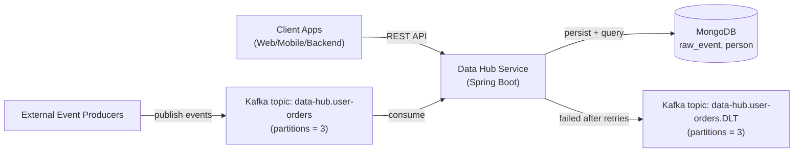
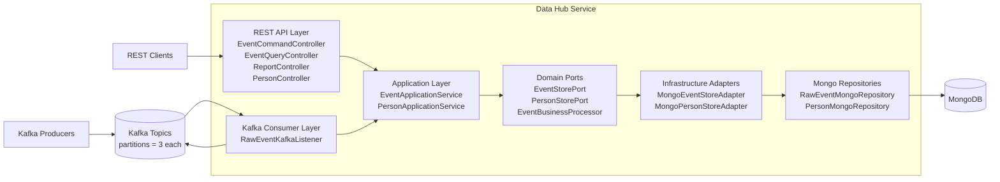
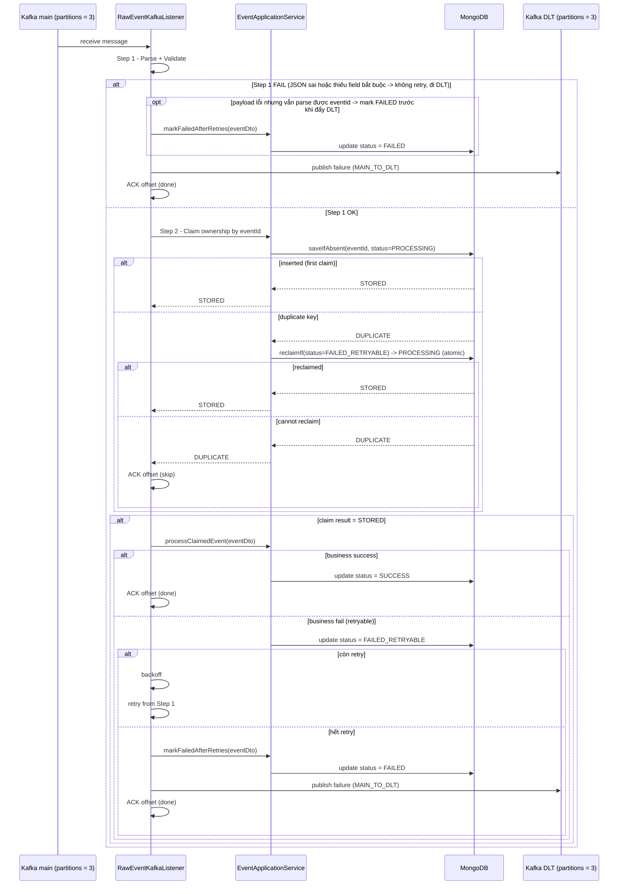

# Data Hub Service

Dự án Spring Boot xử lý event theo mô hình Clean/Hexagonal Architecture: nhận event từ Kafka, xây dựng một service để tiếp nhận, xử lý và quản lý dữ liệu, lưu MongoDB, và cung cấp API truy vấn/report.

## 1. Architecture Overview

### 1.1 Kiến trúc tổng thể

- `interfaces` (REST/Kafka): nhận request/message từ bên ngoài.
- `application` (use case + service): điều phối luồng nghiệp vụ.
- `domain` (model + port): định nghĩa nghiệp vụ lõi, không phụ thuộc framework.
- `shared` (exception + handler): chứa cross-cutting concerns dùng chung giữa các layer.
- `infrastructure` (adapter + repository + config): triển khai kỹ thuật cụ thể (MongoDB, Kafka, Security, Bean).

### 1.2 Sơ đồ component

#### Level 1 - System Context


#### Level 2 - Container View



Cách đọc:
- Context diagram: cho người đọc business/system-level thấy hệ thống giao tiếp với ai.
- Container diagram: cho dev thấy trách nhiệm từng khối trong service và dependency direction.

### 1.3 Mapping package theo tầng

- `interfaces/rest`: HTTP controllers + request/response mapper.
- `application/service`: hiện thực use case.
- `application/usecase`: contract cho tầng interface gọi vào.
- `domain/port`: contract cho tầng application gọi ra infrastructure.
- `shared`: exception domain-level + `GlobalExceptionHandler` cho REST error mapping.
- `infrastructure/persistence`: adapter + repository + document Mongo.
- `infrastructure/kafka`: listener, consumer config, topic config, producer scheduler.

## 2. Luồng xử lý message

### 2.1 Luồng Kafka consume (chính)


#### Nhánh lỗi và retry

1. Listener parse + validate trước khi xử lý business.
2. Nếu lỗi ngay từ bước đọc dữ liệu (JSON sai, thiếu field bắt buộc) thì bỏ qua retry, đẩy thẳng DLT và `ack`.
3. Claim dùng `saveIfAbsent(eventId, status=PROCESSING)` (atomic insert-if-absent).
4. Nếu duplicate, service thử reclaim atomically khi record đang `FAILED_RETRYABLE`.
5. Reclaim thành công thì tiếp tục xử lý như event mới; reclaim thất bại thì coi là duplicate và skip.
6. Khi business fail retryable, service set `FAILED_RETRYABLE` (không delete record).
7. Retry luôn quay lại từ Step 1; chỉ retry với lỗi retryable.
8. Hết retry: `markFailedAfterRetries` -> `FAILED` -> publish DLT -> `ack`.
### 2.2 Luồng REST command/query

#### Command flow (`POST/PUT/DELETE /api/events`)

`Controller -> RestRequestMapper -> ManageEventUseCase(EventApplicationService) -> EventStorePort -> MongoEventStoreAdapter -> RawEventMongoRepository -> MongoDB`

#### Query flow (`GET /api/events`, `GET /api/events/{eventId}`, `GET /api/reports/ingestion-summary`)

`Controller -> QueryEventUseCase(EventApplicationService) -> EventStorePort -> Mongo adapter/repository -> MongoDB -> RestResponseMapper -> response`

## 3. Tài liệu thiết kế DB

### 3.1 Collection `raw_event`

Mục tiêu: lưu event thô + trạng thái xử lý để support ingest idempotent, audit, và report.

#### Schema chính

- `id` (Mongo ObjectId)
- `eventId` (business key, unique)
- `eventType`
- `sourceSystem`
- `status` (`PROCESSING` | `SUCCESS` | `FAILED_RETRYABLE` | `FAILED`)
- `payload` (JSON string gốc)
- `createdAt` (thời điểm event sinh ra)
- `updatedAt` (thời điểm hệ thống ghi/cập nhật)

#### Index hiện tại

- `uk_event_event_id` (unique trên `eventId`)
- `idx_event_type`
- `idx_event_source_system`
- `idx_event_status`
- `idx_event_updated_at`

#### Vì sao thiết kế như vậy

1. **Unique `eventId`** để chống lưu trùng khi duplicate từ Kafka/REST.
2. **`status` riêng** để theo dõi lifecycle xử lý và hỗ trợ retry/failure analysis.
3. **Tách `createdAt` và `updatedAt`** để phân biệt thời gian nghiệp vụ và thời gian xử lý hệ thống.
4. **Index `updatedAt`** phục vụ filter theo cửa sổ thời gian cho report; **index `sourceSystem`** phục vụ tra cứu và mở rộng truy vấn theo nguồn.
5. **Lưu `payload` dạng string** để giữ nguyên raw event, tránh coupling chặt vào schema payload động từ upstream.

### 3.2 Collection `person`

Mục tiêu: module CRUD đơn giản để minh họa thêm một aggregate khác.

Schema:
- `id`
- `name`
- `age`

Hiện chưa có index custom vì use case hiện tại chỉ tạo mới, chưa có truy vấn phức tạp.

### 3.3 Consistency và duplicate handling

- Duplicate được chặn ở tầng DB (unique index) và phản ánh lên service qua `DUPLICATE`.
- Consumer dùng manual ack (`MANUAL_IMMEDIATE`) + `enable-auto-commit=false` để tránh mất message khi service restart.
- Semantics hiện tại là **at-least-once** (ưu tiên không mất dữ liệu; có thể nhận duplicate và xử lý idempotent theo `eventId`).

## 4. API chính

- `GET /ping`
- `POST /api/events`
- `PUT /api/events/{eventId}`
- `DELETE /api/events/{eventId}`
- `GET /api/events`
- `GET /api/events/{eventId}`
- `GET /api/reports/ingestion-summary?from=&to=`
- `POST /api/person`

## 5. Chạy local nhanh

### 5.1 Start dependencies

```bash
docker compose up -d
```

### 5.2 Run app

```bash
./mvnw spring-boot:run
```

App mặc định chạy tại `http://localhost:8084`.

### 5.3 Run test

```bash
./mvnw test
```
